# AI Object Detection with Pan/Tilt and Water Pistol

**This is work in progress, documentation and guide will get better!!**

This project is the follow up to a recent prototype (image below) for a device to deter animals and large birds. The
original prototype used a pimornoi pan tilt hat but the servos
did not have the power to support the waterpistol componets well.   Although it did work it still needed alot of improvements...
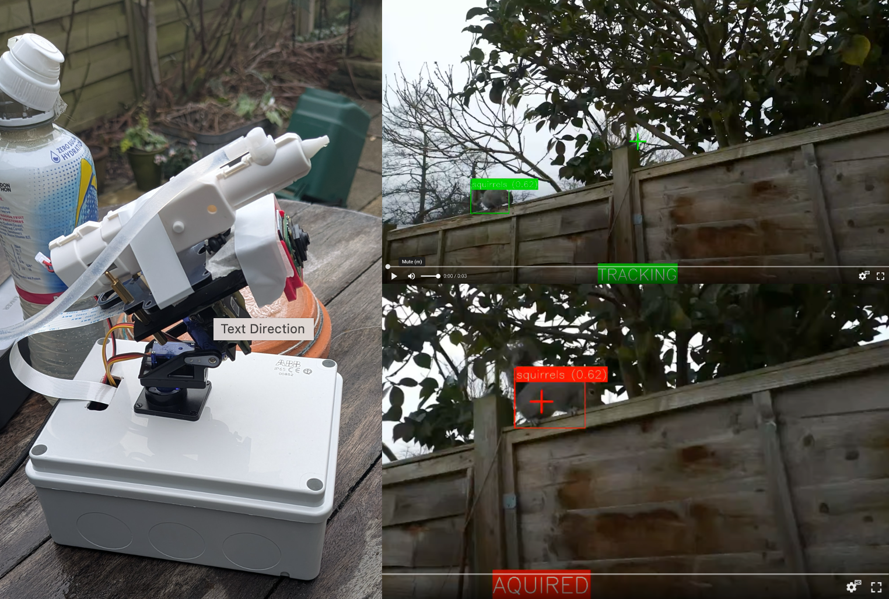

Curerntly have provided object detection models in the imx500 format (`.rpk`) for __Herons__, __Jays__, __Magpies__, __Pigeons__, __Squirrels__, __Cats__ and __Foxes__.  There
are also models that are trained on all of these or a combination of them.  But it should work with any object detection model in this fomrat.  Will converting them to
work on the Raspberry PI AI Kit/Hat (Halio) soon.  See [AI Models](#ai-models-for-ai-camera) for list of them.

This is still a work in progress and is shared to allow others to create their own personal devices to use. 
If you are beginner with a raspberry PI you may wish to try other projects first and get familiar with them. 
We will be releasing a kit to purchase that will make it easier and a fully assembled product. 

Currently, it has only been tested on a Raspberry Pi 4b with an AI Camera, but I plan to do the following variations

* Raspberry Pi 5 with AI camera
* Raspberry Pi 5 or 4b any camera
* Raspberry Pi 5 with any camera plus AI accelerator 
* Raspberry Pi Zero 2w with AI camera (a compact version)
***
# Contents
[Main Part List](#main-part-list)  
[Power Supply Parts](#power-supply)  
[Connecting the Parts & Wiring](#connecting-the-parts-together)
[Assembly Guide -TBC](#assembly-guide)  
[Software Setup](#getting-it-running)  
[Operating Modes](#modes-of-operation)  
[How object Tracking Works](#how-tracking-an-object-works)  
[AI Models](#ai-models-for-ai-camera)  
[Yolov8n Quantized Evaluation](docs/model_comparison.md)  
[Useful Links](#useful-links)
[Common Issues / FAQs](#common-issues--faqs)  


***
# Main Part list
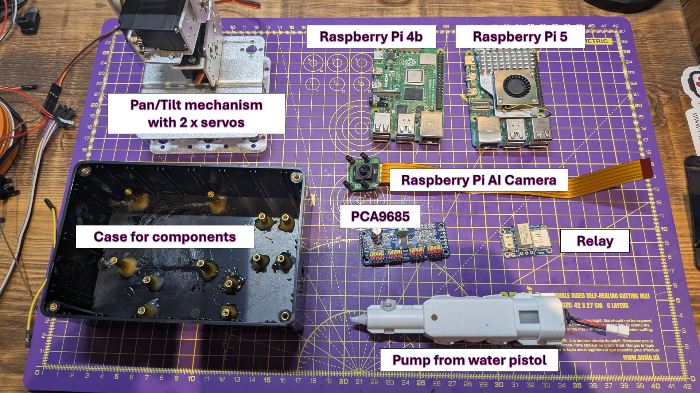

You will need parts similar to these:
* Raspberry Pi (4b or 5)
* Raspberry Pi AI Camera
* PCA9685 servo controller
* None latching relay
* Electric water pistol
* Pan / Tilt Mechanism
* 2 x Servos
* Power Supply
* Cables for connecting it up
* Tubing for water pistol
* Case for Components

### Links to parts
You can use these or similair, the links give you an idea of what you might 
need but can be sourced from any supplier :-)  Will add other links later

| Description                             | Links                                                                                |
|-----------------------------------------|--------------------------------------------------------------------------------------|
| Raspberry Pi 4b                         | [Pimornoi](https://shop.pimoroni.com/products/raspberry-pi-4?variant=29157087412307) |
| Raspberry Pi 5b                         | [Pimoroni](https://shop.pimoroni.com/products/raspberry-pi-5?variant=42119790428243) |
| Raspberry Pi AI Camera                  | [Pimoroni](https://shop.pimoroni.com/products/raspberry-pi-ai-camera)                |
| PCA9685 Servo Contoller                 | [Amazon](https://www.amazon.co.uk/dp/B0BKZC1XWR)                                     |
| None Lataching Relay                    | [Adafruit](https://www.adafruit.com/product/4409)                                    |
| Electric Water Pistol                   | [Amazon](https://www.amazon.co.uk/dp/B0BWNDTKFJ)                                     |
| Pantilt Mechanism                       | [Ali Express](https://www.aliexpress.com/item/1406199345.html)                       |
| Alternate Yahboom Pantilt Mechanism     | [Ali Express](https://www.aliexpress.com/item/1005007297989706.html)                 |
| 2 x Servos                              | [Ali Express](https://www.aliexpress.com/item/1005007208312977.html)                 |
| Power Supply                            | [See Power Supply Section](#Power-Supply)                                            |
| Cables                                  | TBC                                                                                  |
| Tubing for water pistol                 | [Amazon](https://www.amazon.co.uk/dp/B07PNQ5BXD)                                     |
| Case fro Components                     | Whatever fits, will add 3d printed one later                                         |

***
# Connecting the parts together

### Water Pistol
You will need to disiasbmle the water pistol and take out the pump mechanism
shown below, the link to the part above is simple to take apart with a screw driver.
Once you have that make sure you keep the connector for the tubing which you put in the
water source.
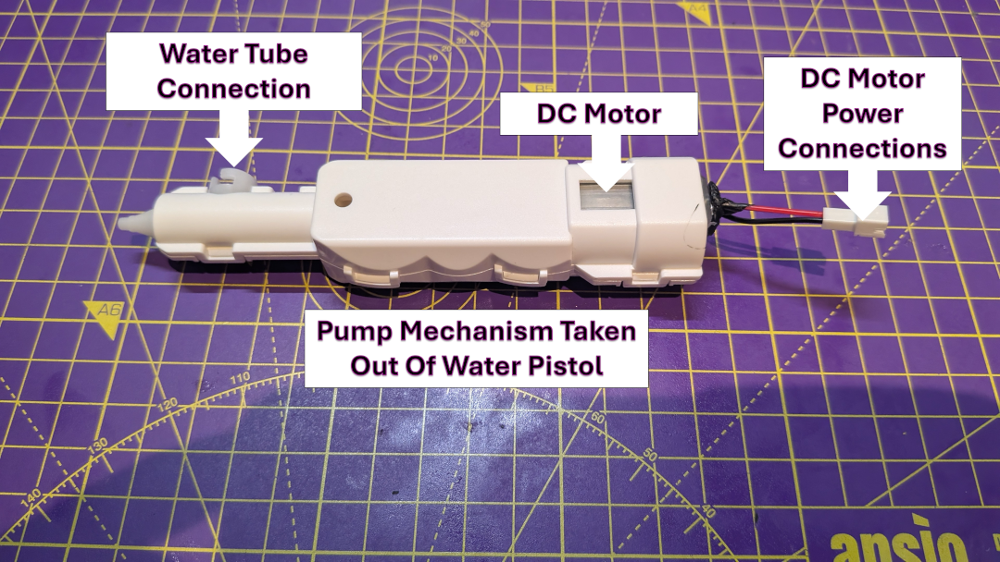

### Other Water Pistols
It can be a bit hit an miss when buying cheap water pistols that are made in China, in the below
diagram are three types I have recevied.

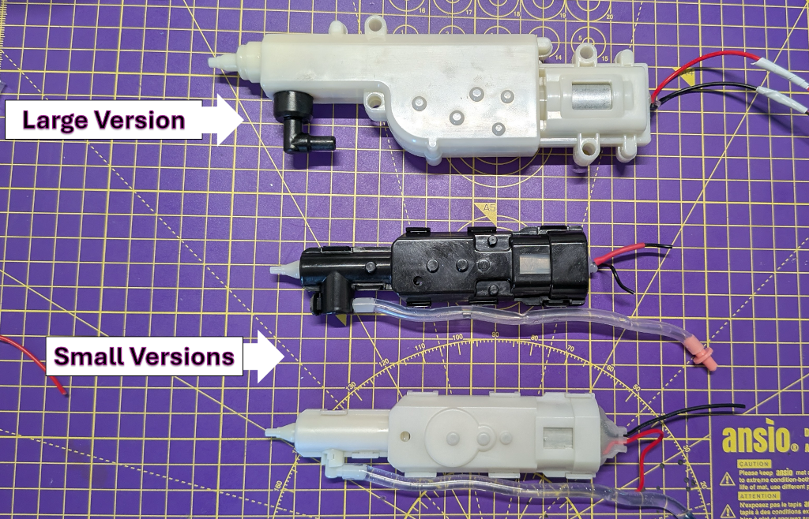
The Large Version is from a different part ordered on ebay, it is alot heavier and may need
more powerful servos to support buy it does fire further and is more powerful.  Here is 
the link I used to buy this one - [ebay](https://www.ebay.co.uk/itm/356473680433). The two smaller versions
both work and came from the same seller on amazon in the part list at the start, so it can be a bit hit and miss
with what you get. It is best not take them apart futher as when re-assembling one I found it lost some of it power
as the one way valves can be delicate.

### Relay 
The Relay I used is shown below, this is used to turn the water pistol mechanism on and off


Connect the DC Motor, Power Source for Motor, Relay and Raspberry Pi as in the below diagram.  For the power supply for the
DC motor you can use the battery as the power source that cam with it for now (I am working on a power supply design).  
**DO NOT try to power the DC motor directly from the raspberry Pi**
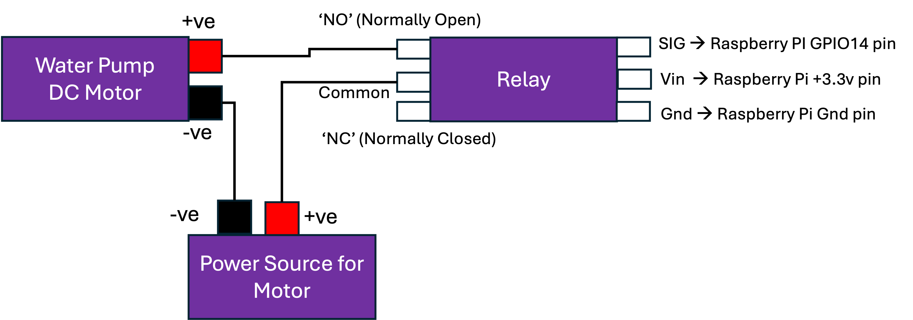

### Pan/Tilt withe servos and PCA9685
The pan/tilt mechanism is used to move the camera and the water pistol together. 
The pan/tilt mechanism is driven by two servos, int he exmaple it is using MG996R 180 degree servos.
The servos are power and contolled by a PCA9685.

You can use whatever pan/tilt mechanism that suits you needs, below is an example pan/tilt with servo connected.
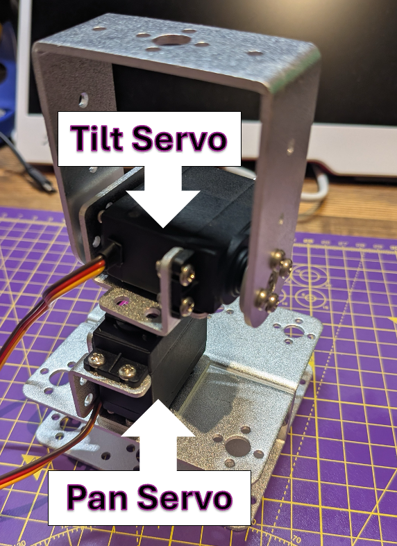

A more stable one is available from yahboom (2DOF) and I have also added an [assmebly guide](docs/yahboom2dof_guide.md) for this.
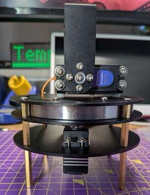

The PCA9685, shown below is used to control the servos.  Due to the stall current
of the servos you need to supply a power source for these direct to the PCA9685.
Also, due to the control signals the grnd ot the raspberry pi must be connected to 
the ground (-ve) of the power supply for the servos so they have a common ground.
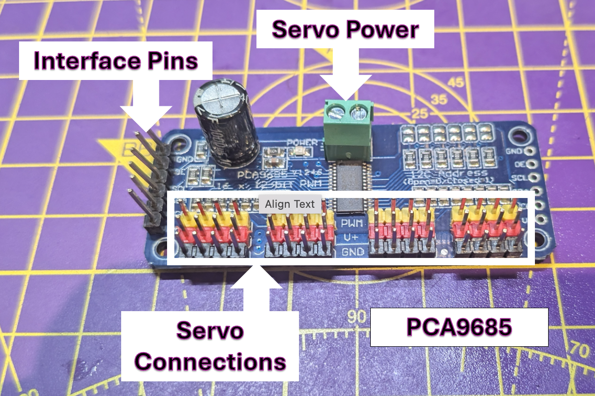

To connect this up the interface pins are connected to the raspberry pi and then the pan servo and 
tilt servo are connected the first two channels (on the left in the above diagram the first two sets of three pins).  
Finally connect the power supply for ther servos the PCA9685.
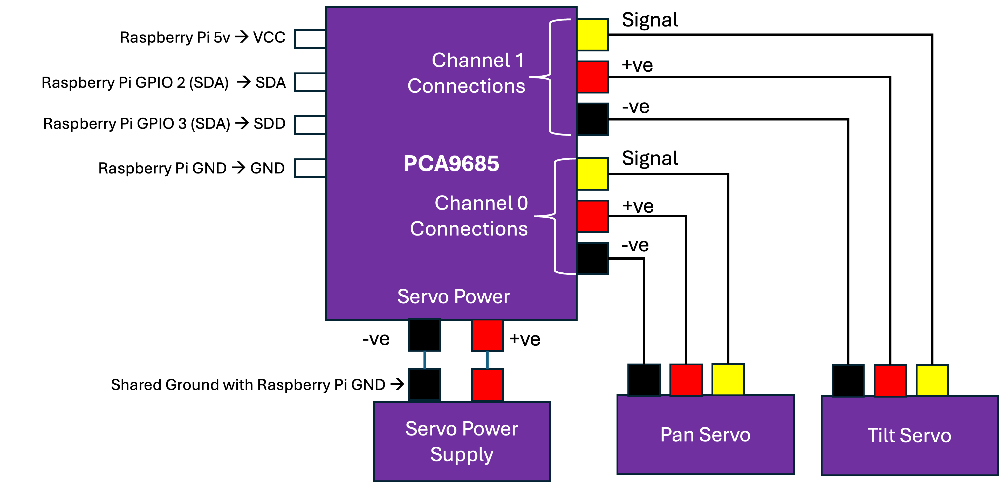

### Overall Wiring Diagram
The below diagram shows the overall circuit wiring for the servos and the water pump dc motor.
Note that the batteries in the image are just for illustration purposes
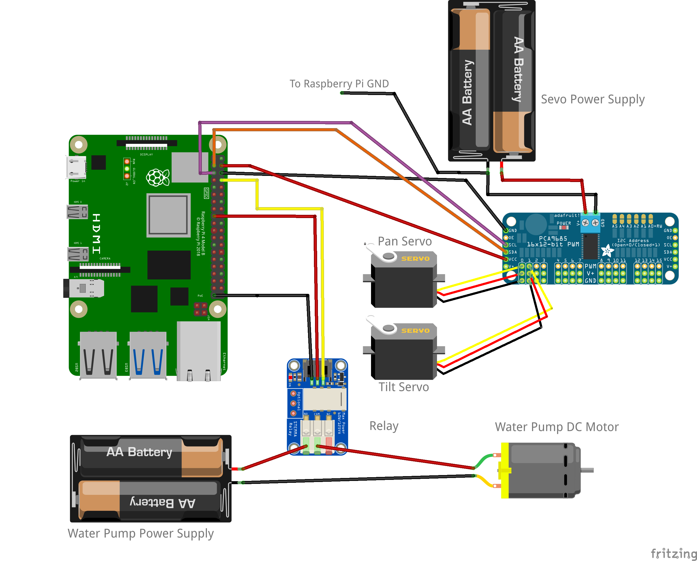

### Power Supply
To be able to run all the components from a single power supply I used a spare 12v 10Amp 
power supply and then three buck converters to seperate the  power sources.
The diagram below shows how it was wired up.
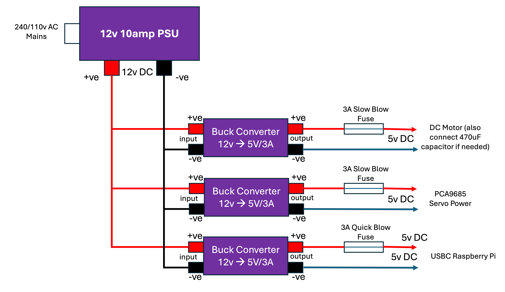
May require a 470uf capacitor across the motor that drives the waterpump mechanism (TBC)

This table shows the key parts that can be used

| Description                        | Link                                                     |
|------------------------------------|----------------------------------------------------------|
| 12v 10Amp Power Supply (110v/240v) | [Amazon](https://www.amazon.co.uk/gp/product/B07J43TMYW) |
| Buck Converter 12v to 5v DC        | [Amazon](https://www.amazon.co.uk/dp/B09PFV3SWN)         |
| In line 5mm x 20mm fuse holder     | [Amazon](https://www.amazon.co.uk/dp/B07C58WPL7)|        
| 3amp slow blow 5mm x 20mm fuse     | [Amazon](https://www.amazon.co.uk/dp/B08FJ7DSBX)         |
| 3amp quick blow 5mm x 20mm fuse    | [Amazon](https://www.amazon.co.uk/F5AL250V-Cartridge-Household-Appliances-Electricals/dp/B0D8VP5YD3)|


If using a raspberry PI5 the above may not work, need to test, but you should be able to use a Power PD Trigger Activation Module instead of one of the buck converters
and also use a 5amp fuse instead of a 3amp fuse.  **This has not been tested yet, but will be soon**.

| Description                        | Link                                                                        |
|------------------------------------|-----------------------------------------------------------------------------|
|Raspberry Pi5 Power PD Trigger Activation Module Jetson 5V5A 27W PD DC USB Dual Input Wide Voltage Dual Output for PI 5| [Ali Express](https://www.aliexpress.com/item/1005007096153347.html)        |


### AI Camera
You simply connect the AI camera to the raspberry pi camera port the Raspberry PI 4b.
Make sure you use the correct cable that comes with it.
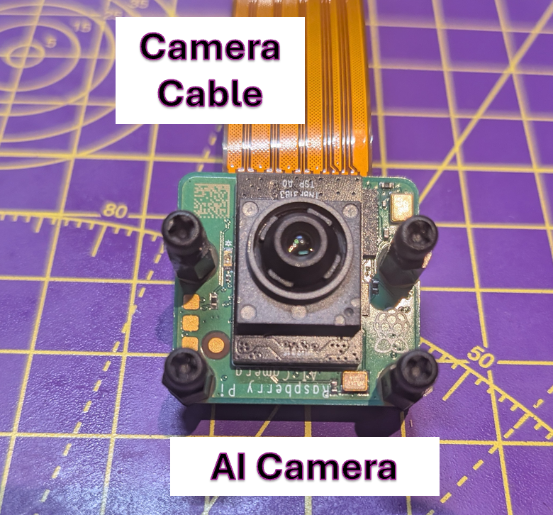

## Assembly Guide
TBC to completed, will contain how to put it all together.  But breifly make sure 
the camera and water pump are mounted on the pan/tilt device and aligned.

This diagram shows an example mounting everything including the raspberry pi in a box ontop of the pan/tilt mechanism.

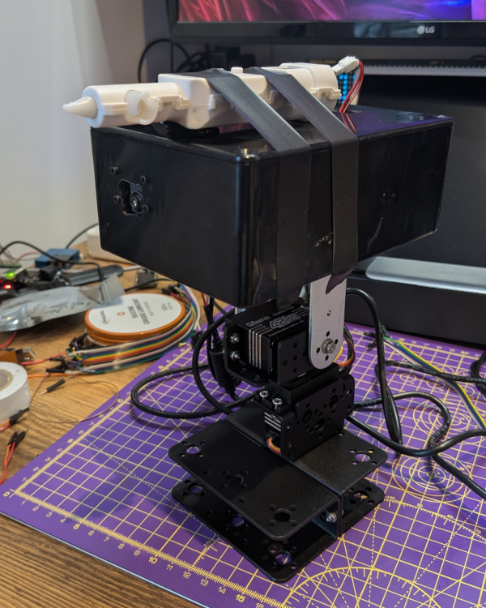


***
# Getting it running
Once all the components are wired up (suggest you dont put it in a box until after you test it) 
you need to make sure the Raspberry PI is installed with the latest version of the Raspberry PI OS.
The install the software which is detailed below.


## Raspberry PI Installation
On the raspberry pi pmake sure it is up to date with the latest packages installed and install the Raspberry Pi AI camera packages `imx500-all` and some extra packages needed to run (they may already be installed but thats ok)

From the terminal run
```
sudo apt update
sudo apt upgrade
sudo apt install imx500-all
sudo apt install python3-opencv python3-munkres
sudo apt install python3 python3-venv python3-pip
sudo apt install ffmpeg git python3-picamera2
```

Enable I2C port on the raspberry pi and reboot (this will be needed for the PCA9685)
```
sudo raspi-config nonint do_i2c 0
sudo reboot
```


## PCA9685 i2c address
When the PCA9685 is connected to the pi you can check you can see it ands it address by running the command `i2cdetect -y 1`.  
If you dont have ic2detect already installed you can install it with `sudo apt install -y i2c-tools`

The output of `i2cdetect -y 1` should look something like this
```
     0  1  2  3  4  5  6  7  8  9  a  b  c  d  e  f
00:                         -- -- -- -- -- -- -- -- file
10: -- -- -- -- -- -- -- -- -- -- -- -- -- -- -- -- 
20: -- -- -- -- -- -- -- -- -- -- -- -- -- -- -- -- 
30: -- -- -- -- -- -- -- -- -- -- -- -- -- -- -- -- 
40: 40 -- -- -- -- -- -- -- -- -- -- -- -- -- -- -- 
50: -- -- -- -- -- -- -- -- -- -- -- -- -- -- -- -- 
60: -- -- -- -- -- -- -- -- -- -- -- -- -- -- -- -- 
70: 70 -- -- -- -- -- -- -- 
```
This shows the Device Address of the PCA9685 module is `0x40` and its all-call address is `0x70`.  If this is different 
you will need to adjust the configuration by 
changing the `I2C_ADDRESS ` in the `my_configuration.py` file
.

## Get software and setup venv


To use the latest __unstable__ version clone the software from Github 
```
cd
git clone https://github.com/dave-ct/ai_object_plus_water.git

```
If you want to use the latest stable release (recommended).  Download the latest [release](https://github.com/dave-ct/ai_object_plus_water/releases/)
and unzip the file in to your home directopry on your raspberry pi.


Create a new `venv` that inherits the site packages, activate it and make sure all packages are installed. 
If using the stable release zip file then make sure  you `cd` to the directory that was unzipped as the name will be
different from the below `ai_object_plus_water` as should include the version number at the end
```
cd ai_object_plus_water
python3 -m venv --system-site-packages myenv
source myenv/bin/activate
pip install -r requirements.txt 
```
## Testing the Relay and Servos
Before you use the main software there are a couple of test scripts
so you can check the relay works and the servo works, you may need to edit them.
Make sure you run them from the `venv` you have setup.

The scripts are:

`test_scripts/pca9685_test.py` for the servo/PCA9685 testing

`test_scripts/relay_test.py` for the relay


## Software Configuration
The configurable parameters are set in the file `my_configuration.py`.  This will be moved to a JSON file in the future 
but to for now use this.  Before you run the `main.py` edit this file to suit your needs.  There are comments in the file to explain it.


## Running the program


Run the `main.py` from within you `venv`
```
python -u main.py
```
If successful you should see something like this in your terminal

```
[0:22:30.207928494] [12234]  INFO Camera camera_manager.cpp:325 libcamera v0.3.2+99-1230f78d
[0:22:30.224500745] [12238]  WARN CameraSensorProperties camera_sensor_properties.cpp:305 No static properties available for 'imx500'
[0:22:30.224554986] [12238]  WARN CameraSensorProperties camera_sensor_properties.cpp:307 Please consider updating the camera sensor properties database
[0:22:30.235821534] [12238]  WARN RPiSdn sdn.cpp:40 Using legacy SDN tuning - please consider moving SDN inside rpi.denoise
[0:22:30.238001426] [12238]  INFO RPI vc4.cpp:447 Registered camera /base/soc/i2c0mux/i2c@1/imx500@1a to Unicam device /dev/media3 and ISP device /dev/media0
[0:22:30.238108888] [12238]  INFO RPI pipeline_base.cpp:1120 Using configuration file '/usr/share/libcamera/pipeline/rpi/vc4/rpi_apps.yaml'

------------------------------------------------------------------------------------------------------------------
NOTE: Loading network firmware onto the IMX500 can take several minutes, please do not close down the application.
------------------------------------------------------------------------------------------------------------------

[0:22:30.319423044] [12234]  INFO Camera camera.cpp:1197 configuring streams: (0) 1920x1080-XBGR8888 (1) 640x360-YUV420 (2) 2028x1520-SRGGB10_CSI2P
[0:22:30.319876392] [12238]  INFO RPI vc4.cpp:622 Sensor: /base/soc/i2c0mux/i2c@1/imx500@1a - Selected sensor format: 2028x1520-SRGGB10_1X10 - Selected unicam format: 2028x1520-pRAA
/home/pi/ai_object_plus_water/main.py:330: RuntimeWarning: This channel is already in use, continuing anyway.  Use GPIO.setwarnings(False) to disable warnings.
  GPIO.setup(self.relay_pin, GPIO.OUT)
2025-01-17 12:50:53 [INFO] my_app_logger: Starting main loop...
 * Serving Flask app 'main'
 * Debug mode: off
WARNING: This is a development server. Do not use it in a production deployment. Use a production WSGI server instead.
 * Running on all addresses (0.0.0.0)
 * Running on http://127.0.0.1:5000
 * Running on http://192.168.0.175:5000
Press CTRL+C to quit

```
Note that the ip address `192.168.0.175` in the above output should appear as the IP address of the raspberry pi you have setup.

You can now access the web interface.  If you are running locally on your raspberry pi with a local display you can go 
to http://127.0.0.1:5000 in your browser.

If you are accessing the raspberry pi remotely use the IP address of your raspberry pi to connect to it, in the example 
above this would be http://192.168.0.175:5000 replacing `192.168.0.175` with the IP address of your raspberry PI 

The web interface is currently not secure and anyone on the network your raspberry pi is connected to can access it.

***
# Modes of Operation
There are two modes of operation you can set when accessing the web interface. By default the program strats in `auto` mode

### Auto Mode
**Automatic Tracking & Shooting**

In auto mode, the system constantly checks for object detections. If it detects a target, it will:
1. Start recording (via `recording_manager.start_recording()`).
2. Start the water pistol `water_pistol.start()`.
3. Track the target automatically by calculating how far the target is from the image center and then adjusting pan/tilt accordingly.

**Going Home When No Target**

If the system loses the target (no detections for a certain time), it will:

1. Stop recording (if it’s still recording).
2. Stop the water pistol.
3. Move the camera back to the “home” position.

Essentially, in auto mode, no user interaction is required. The camera tracks automatically and fires the water pistol when a target is found.

### Manual Mode

**User-Controlled Movement**

In manual mode, the code ignores the automatic detection logic. The user can:

1. Move the camera up/down/left/right using the /move endpoint.
2. Set a new home position by calling `/set_home` (which saves the current angles as the new home).
3. Manually turn the water pistol on/off with the `/water_pistol?action=start|stop` endpoint. 

**No Automatic Tracking**

Because the code isn’t watching detections to move the camera or fire automatically, all actions must be triggered by the user’s HTTP requests.
Essentially, manual mode is for direct user control without any automatic detection or firing.


***
# How Tracking an object works

Below is a brief explanation of how the camera **tracks** a detected object and uses a **dead zone** to avoid small, unnecessary movements:

1. **Find the object’s center** in the image (e.g., `center_x`, `center_y`).
2. **Compute the offset** from the image center:
```python
offset_x = center_x - (frame_width / 2)
offset_y = center_y - (frame_height / 2)
   ```
3. **Check the dead zone:**
```python
if abs(offset_x) < DEAD_ZONE and abs(offset_y) < DEAD_ZONE:
    return  # No movement needed
   ```
If the object is within these pixel thresholds, the system doesn’t move.

4. **Convert offsets to angles:**
```python
delta_pan  = offset_x * PAN_DEG_PER_PIXEL
delta_tilt = offset_y * TILT_DEG_PER_PIXEL
```
5. **Invert if needed (depending on hardware orientation):**
```python
if PAN_INVERT:
    delta_pan = -delta_pan
if TILT_INVERT:
    delta_tilt = -delta_tilt
```
6. **Update the camera angles and physically move:**
```python
new_pan_angle  = current_pan + delta_pan
new_tilt_angle = current_tilt + delta_tilt
pan_tilt_control.move_to(new_pan_angle, new_tilt_angle, steps=..., step_delay=...)
```
By having a DEAD_ZONE, the camera avoids jittery motion when the target is already centered enough, resulting in smoother tracking.


***
## AI Models for AI Camera
The current object detection model is derived from a custom trained yolov8n on over 20,000 images.  After training it was 
quantized and exported using YOLO in the `imx` format.  After which it is then converted to `.rpk` format.

Models are available in this repository are in the below table, just update the `my_configuration.py` with the details for the mode 
you want to use, that is update `MODEL =` and `LABEL = `

| Model Name                           | Animals Trained On                                      | Model File to Use                                         | Label File to Use                                             |
|--------------------------------------|---------------------------------------------------------|-----------------------------------------------------------|---------------------------------------------------------------|
| train_all_yolov8n_150_32             | Squirrels, Cats, Piegons, Magpies & Jays                | `models/train_all_yolov8n_150_32/network.rpk`             | `models/train_all_yolov8n_150_32/labels.txt`                  |
| train_cats_yolov8n_150_32            | Cats                                                    | `models/train_cats_yolov8n_150_32/network.rpk`            | `models/train_cats_yolov8n_150_32/labels.txt`                 |
| train_jays_yolov8n_150_32            | Jays                                                    | `models/train_jays_yolov8n_150_32/network.rpk`            | `models/train_jays_yolov8n_150_32/labels.txt`                 |
| train_magpies_yolov8n_150_32         | Magpies                                                 | `models/train_magpies_yolov8n_150_32/network.rpk`         | `models/train_magpies_yolov8n_150_32/labels.txt`              |
| train_pigeons_yolov8n_150_32         | Piegons                                                 | `models/train_pigeons_yolov8n_150_32/network.rpk`         | `mmodels/train_pigeons_yolov8n_150_32/labels.txt`             |
| train_squirrels_yolov8n_150_32       | Squirrels                                               | `models/train_squirrels_yolov8n_150_32/network.rpk`       | `models/train_squirrels_yolov8n_150_32/labels.txt`            |
| big_data_a2_200e_32b                 | Squirrels, Piegons, Magpies & Jays                      | `models/big_data_a2_200e_32b/network.rpk`                 | `models/big_data_a2_200e_32b/labels.txt`                      |
| train_herons_yolov8n_150_32          | Herons                                                  | `models/train_herons_yolov8n_150_32/network.rpk`          | `models/train_herons_yolov8n_150_32/labels.txt`               |
| train_all_with_herons_yolov8n_150_32 | Squirrels, Cats, Piegons, Magpies, Jays & Herons        | `models/train_all_with_herons_yolov8n_150_32/network.rpk` | `models/train_all_with_herons_yolov8n_150_32/labels.txt`      |
| train_foxes_yolov8n_175_32           | Foxes                                                   | `models/train_foxes_yolov8n_175_32/network.rpk`           | `models/train_foxes_yolov8n_175_32/labels.txt`                |
|train_all_with_herons_foxes_yolov8n_175_32| Squirrels, Cats, Piegons, Magpies, Jays, Herons & Foxes |`models/train_all_with_herons_foxes_yolov8n_175_32/network.rpk`| `models/train_all_with_herons_foxes_yolov8n_175_32/labels.txt`|


### Example Model Yolov8n - big_data_a2_200e_32b

When training this model an open source dataset was used for the squirrels and custom datasets with annotations where 
created for the jays, piegons and magpies.
Backrounf images where addded with other bir types, animals etc to help it prevent from identifying the other species.  
It was trained with batch size of 32 and over 200 epochs.

**Training Image Volume:**
1. squirrels - 2726
2. jays - 5929
3. pigeons - 1564
4. magpies - 5665
5. background - 1321

**Evaluation Image Volume**
1. squirrels - 719
2. jays - 1443
3. pigeons - 387
4. magpies - 1441
5. background - 313

**Evaluation Metrics**
```
 Class     Images  Instances    Box(P          R      mAP50    mAP50-95)
 all       4302       4189          0.955     0.944   0.966    0.915
 squirrels 719        783           0.903     0.856   0.903    0.776
 jays      1442       1480          0.986     0.961   0.99     0.973
 pigeons   387        400           0.96      0.983   0.982    0.944
 magpies   1441       1526          0.971     0.976   0.99     0.967
```
**Confusion Matrix**
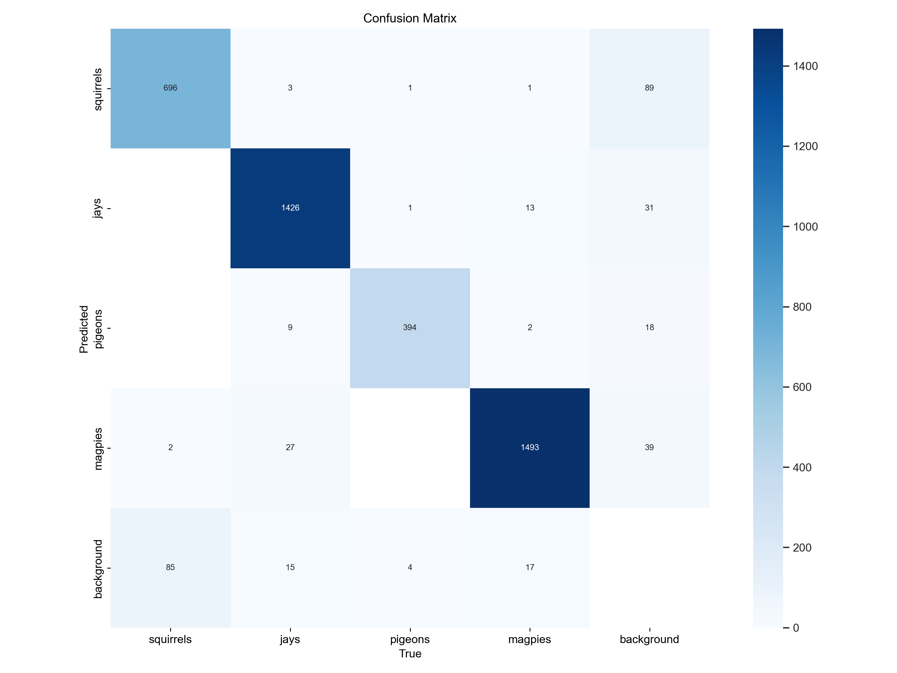

To see an evaluation of the orignal Yolov8n vs the Qunatized version see [Yolov8n Quantized Evaluation](docs/model_comparison.md)  

Note - In the future will create larger pigeon dataset and then my own squirrel one (the exsiting squirrel one already had 
augmentation so repeated images whereas the ones I created where all unique images) as that was not best quailty data.

***
# Pimoroni Pan Tilt Hat
The original prototype used  the [piromoni pan tilt hat](https://shop.pimoroni.com/products/pan-tilt-hat)
but this was designed just for a small camera and the servos did not have the stability to support the water pump mechanism
when firing without alot of induced movement from the motor when it was on.  But the original code used for this can be found at
`Pimoroni_pan_tilt_hat/pan_tilt_hat.py`.  If you want to use this you will need to replace `pan_tilt_control.py` with the 
contents of this file.  
The imports may also need tweeking (I have not tested this recently but provided in case you are interested)

***
## Useful Links
[Raspberry Pi AI Camera Documentation](https://www.raspberrypi.com/documentation/accessories/ai-camera.html) - How to install and setup the Raspberry PI Camera

[Sony IMX500 Export for Ultralytics YOLOv8 Documentation](https://docs.ultralytics.com/integrations/sony-imx500/) - How to create your own models using YoloV8n for the Raspberry Pi AI Camera

[PCA9685 Servo Driver guide from Kevs Robots](https://www.kevsrobots.com/learn/pca9685/04_introduction_to_pca9685.html) - Useful resource on working with Servos. 

***
## License
Software is Licensed under Apache 2 with a common clause so it cannot be used for commercial purposes at this time.  See the [LICENSE](LICENSE) file for details.
Basically this is just for personal use for people who want to build their own device.

If you use the models derived from Yolov8 see the [license file](models/LICENSE)

***
## Common Issues / FAQs
Note  - Add as needed


