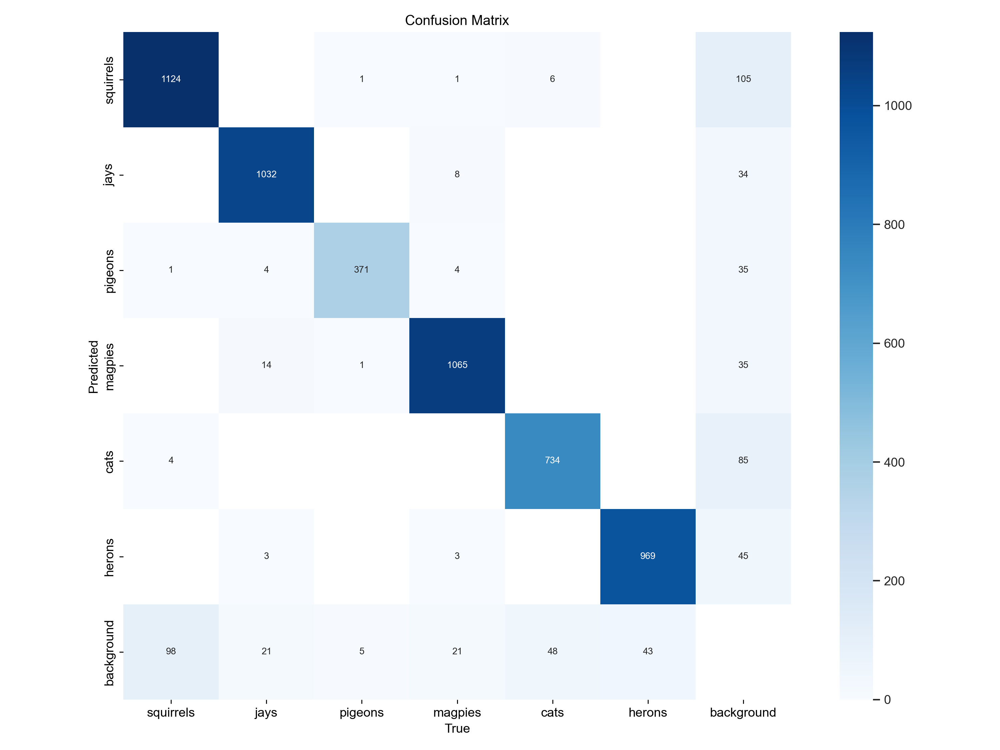

# Example Model Comparision

## Introduction
In this document, we compare the performance of an Orginal trained model vs the Quantized model that
is used on the Raspberry PI AI camera. 
The model used in this comparision was the `train_all_with_herons_yolov8n_150_32` which at of writing has
the most classes.  The two models are:

* __Original__ YOLOv8n (fine-tuned on the dataset)  
* __Quantized__ YOLOv8n (INT8) (exported to IMX format)

Both models were evaluated on the same validation set with 6 classes using 5509 images, 373 backgrounds. 
The goal is to understand how quantization impacts the accuracy.


## Model Validation Results
The below table shows a comparison of the validation results of the two models.


| Metric            | Orignal YOLOv8n | Quantized YOLOv8n |
|-------------------|-----------------|-------------------|
| Precision (Box P) | 0.952           | 0.948             |
| Recall (R)        | 0.936           | 0.927             |
| mAP @ 0.5         | 0.972           | 0.969             |
| mAP @ 0.5 - 0.95  | 0.913           | 0.852             |


### Orignal Validation Results
```yaml
Class       Images  Instances    Box(P          R      mAP50  mAP50-95):
all         5509       5581      0.952      0.936      0.972      0.913
squirrels   1143       1227       0.93      0.893      0.927      0.814
jays        1042       1074      0.984      0.953       0.99      0.974
pigeons      362        378      0.925      0.972      0.986      0.956
magpies     1022       1102      0.972      0.954      0.989      0.969
cats         682        788      0.938      0.904      0.962      0.867
herons       885       1012      0.966      0.939       0.98      0.896
```

### Quantized Validation Results
```yaml
Class       Images  Instances    Box(P          R      mAP50  mAP50-95): 
all         5509       5581      0.948      0.927      0.969      0.852
squirrels   1143       1227      0.913      0.895      0.925      0.767
jays        1042       1074      0.982       0.95      0.989      0.923
pigeons     362        378       0.928      0.952      0.979      0.886
magpies     1022       1102       0.97      0.942      0.988      0.908
cats        682        788       0.934      0.893      0.958      0.804
herons      885       1012       0.959       0.93      0.973      0.822
```

## Confusion Matrices
### Original YOLOv8n Confusion Matrix


### Quantized YOLOv8n (INT8) Confusion Matrix


## Conclusion 

Overall, the Quantized YOLOv8n (INT8) model achieves nearly the same high performance as the Original YOLOv8n on the given
validation set while offering a significant advantage for running on the Raspberry Pi’s AI camera in the IMX format.
From past experience, inference on a Raspberry Pi (4/5) without AI acceleration can typically achieve around 4-6 FPS and on the raspberry pi zero much less. 
However, leveraging the AI camera with the IMX model can boost performance to approximately 24 FPS, making it much more practical 
for real-time applications. Although there is a slight decrease in metrics—particularly in mAP@0.5–0.95—the trade-off is 
justified by the lower computational footprint and faster inference times. For scenarios where resource efficiency and 
real-time object detection are priorities, the quantized model provides a highly suitable solution with only a minor reduction in accuracy.
