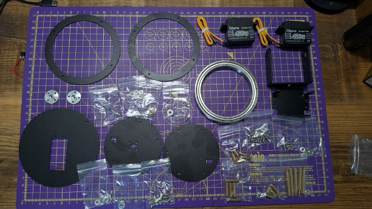
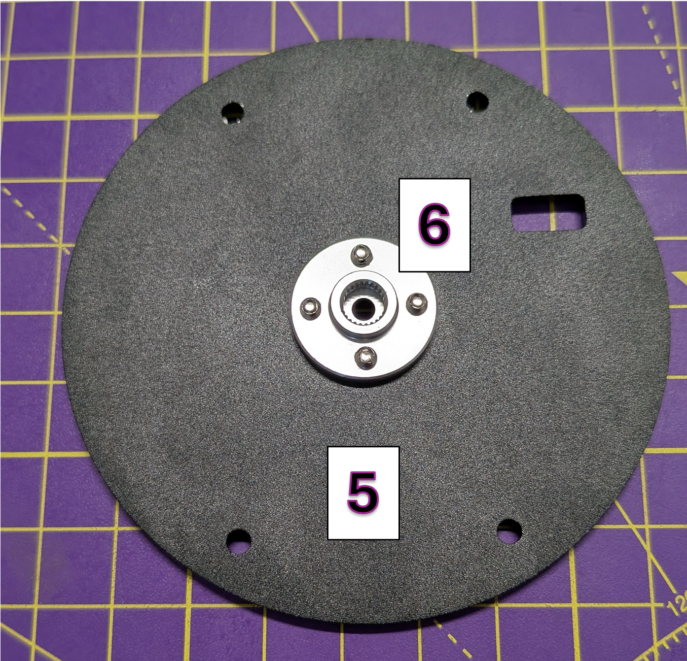
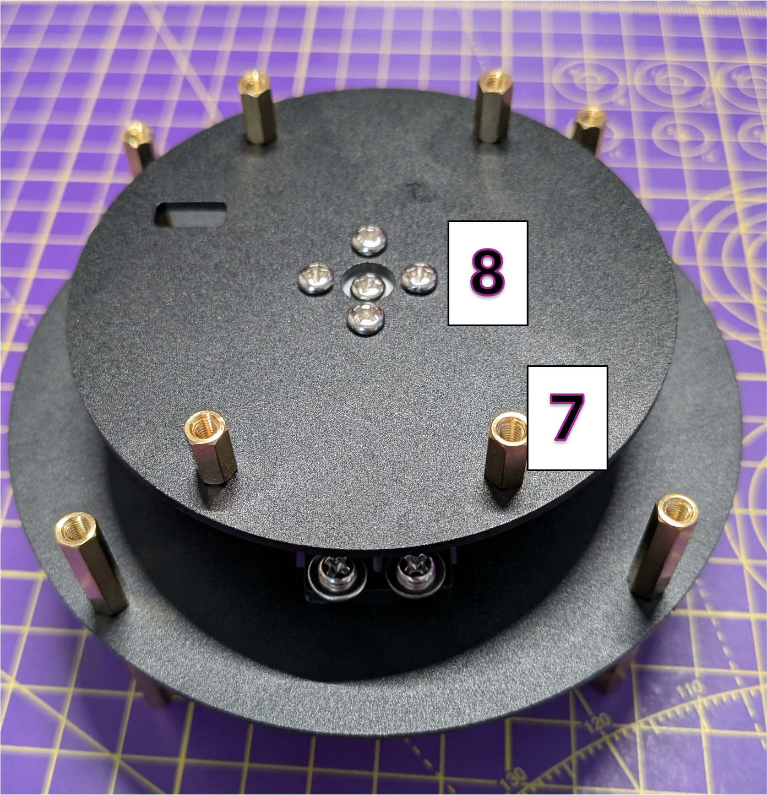
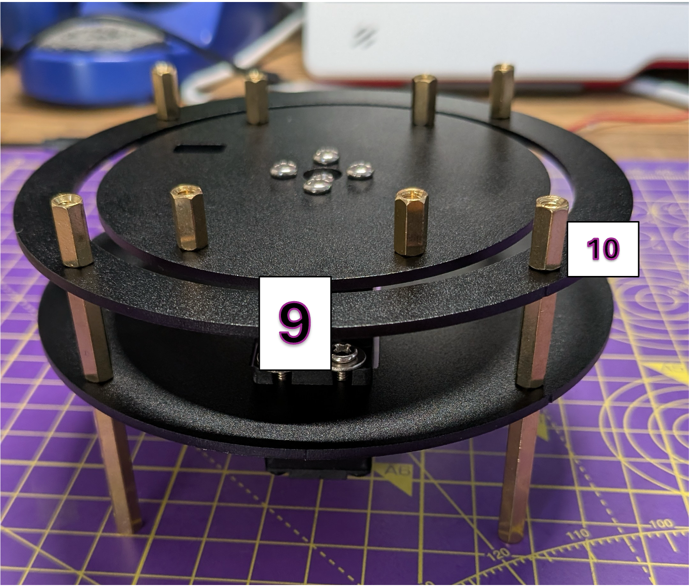
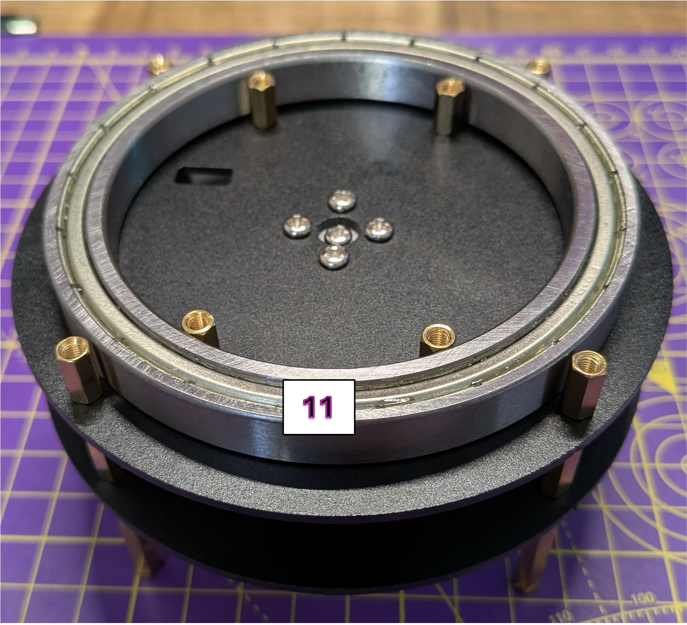
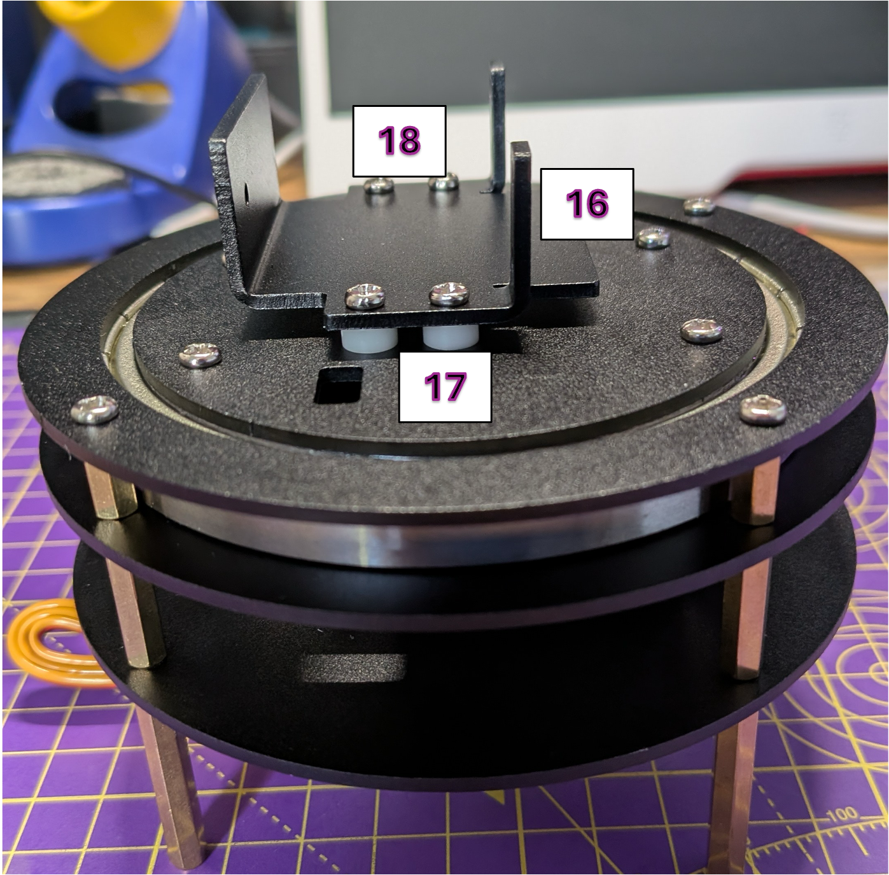

# Yahboom 2DOF - Assembly Guide

See the [Yahboom Site](http://www.yahboom.net/study/2DOF-PTZ) for specifications
and further details
## Parts

## Step 1

Setup the base using 4 x long spacers (1) and 4 medium spacers (2).  Make sure
the baseplate (3) is the one with the gap for a servo.

## Step 2

Install the first servo (3) into the baseplate and secure with 4 x screws and 
4 x washers (4)

## Step 3

Connect the servo insert (6) to the small plate using 4 x screws (6)

## Step 4

Connect 4 small spacers (7) to the plate in Step 3 usin 4 x screws and then connect
the small plate to the servo (8) by inserting it into the teeth and scuring with a single screw in
the centre.

## Step 5

Use on of the large circle pieces (9) and secure it with the 4 x small spacers (10)

## Step 6

Place the large bearing (11) between the spacers

## Step 7

Using the second small plate (12) secure it to the internal small spacers using
4 x screws, make sure it is tight.  Then secure the second large circle piece (14) using 4 x screws
(15) to the external spacers, make sure it is tight.

## Step 8

Connect the servo mounting bracket (16) using 4 x spacers (17) with 4 x screws (18) to the small plate.

## Step 9

Connect the second servo (19) to the mounting bracket with 4 x screws and 4 x washers (20).

## Step 10

On the tilt arm inser the small bearing (21) so the lip is on inside.  Connect the second
servo insert (20) to the other side of the tilt arm securing it with 4 screws.  Make sure the groove
to connect to servo is on the inside of the tilt arm.

## Step 11

COnnect the tilt arm to the servo assembly and secure to the servo (22) using a screw and secure
the other side to the small bearing (24) using a screw. 

## Finshed Assemebly :-)

You should now have fully assmebled pan tilt mechanism, hope this guide was useful!!

